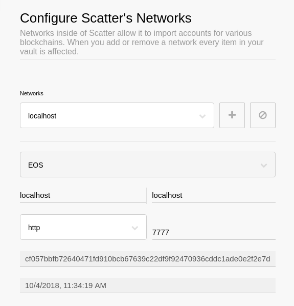
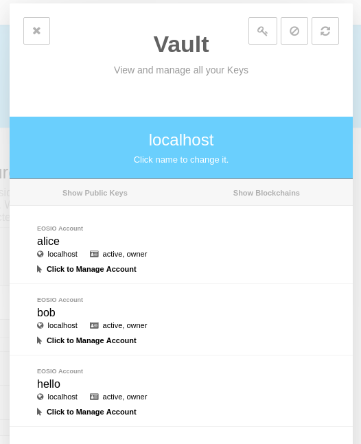
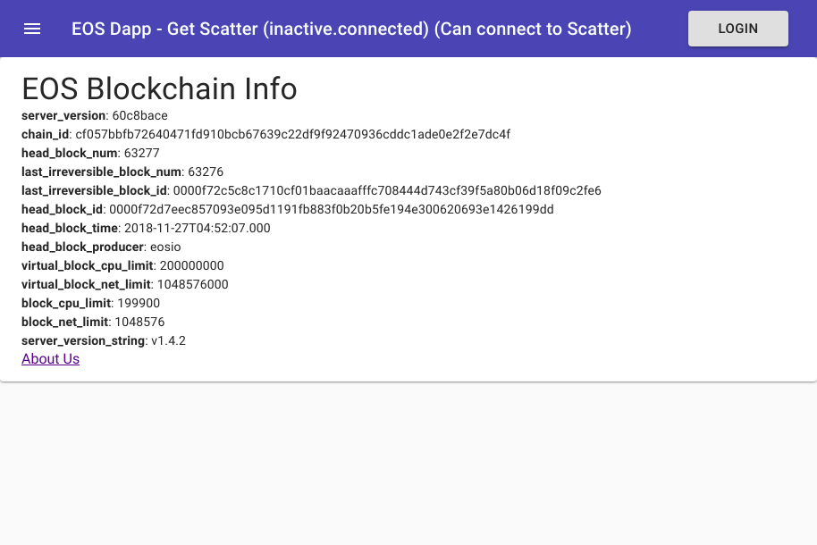
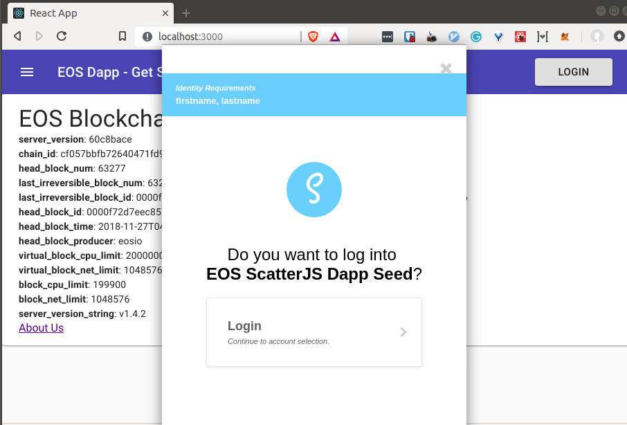
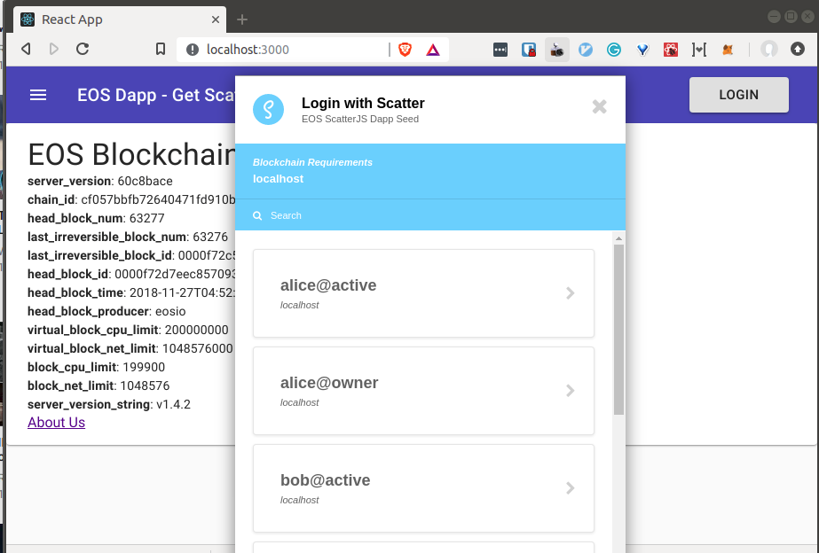
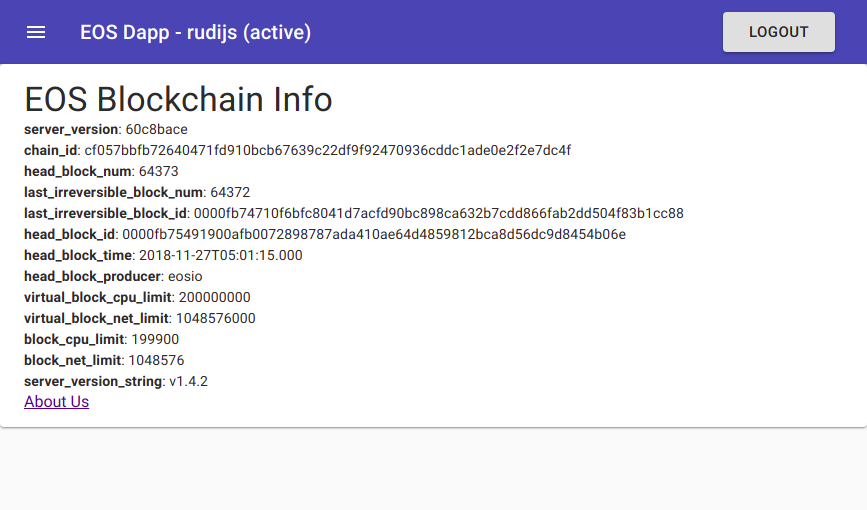
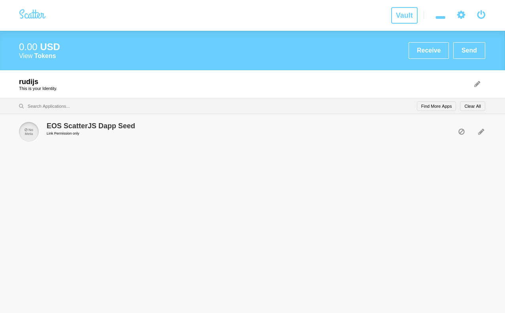

# eos-scatter-desktop-dapp-seed

Opinionated EOS ScatterJS Dapp Seed

## Overview

This is a sample developer starter project to:

1. Setup, learn and use the EOS blockchain in a local environment
2. Interact with the EOSIO blockchain using Scatter (signature, identity, and reputation provider)

## Project Components

- [Docker](https://www.docker.com/)
- [ReactJS (create-react-app v2)](https://github.com/facebook/create-react-app)
- [ScatterJS](https://github.com/GetScatter/scatter-js)
- [mobx-state-tree](https://github.com/mobxjs/mobx-state-tree)
- [xstate](http://davidkpiano.github.io/xstate/docs/#/)
- [Material-UI](https://material-ui.com/)
- react-i18n

## Documentation

## Step 1

We'll begin by creating a local EOSIO blockchain.

Steps 1 and 2 below are extracted verbatim from the EOSIO documentation at [https://developers.eos.io/eosio-home/docs](https://developers.eos.io/eosio-home/docs)

1. [Create Local Development EOS Blockchain](docs/create_blockchain.md)
2. [Hello World Smart Contract](docs/hello_world.md)

## Step 2

With a running local EOSIO blockchain and deployed hello world smart contract, next we'll configure Scatter Destkop:

1. Install [Scatter Desktop](https://github.com/GetScatter/ScatterDesktop/releases)
2. Get the _chain_id_ from the JSON output from this URL [http://localhost:7777/v1/chain/get_info](http://localhost:7777/v1/chain/get_info)
3. Scatter -> Settings -> Networks: Then add a new **localhost** network like so:

4. Next add your private key from your localhost accounts (bob and alice), run this command:
5. `cleos wallet private_keys`
6. Scatter -> Vault -> New -> Name: 'localhost' -> Import -> Text of QR -> Enter a Private Key ...
7. Scatter should scan and detect your locahost EOSIO account, like so:

## Step 3

Now with a local EOSIO blockchian running, Scatter destop configured, we can fire up our DAPP and _sign in_

- `cd ~/p/eos-scatter-desktop-dapp-seed`
- `npm install`
- `npm start`

## Start - not authenticated

## Sign in

## Choose Account

## Authenticated - Logout

## Scatter UI - Logout

